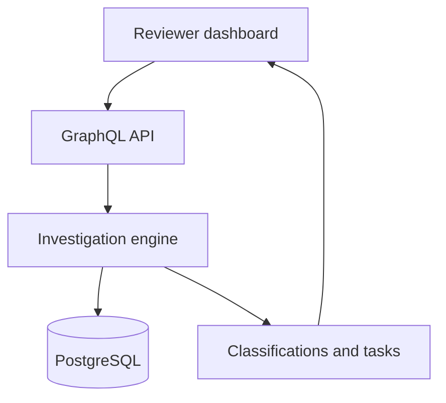
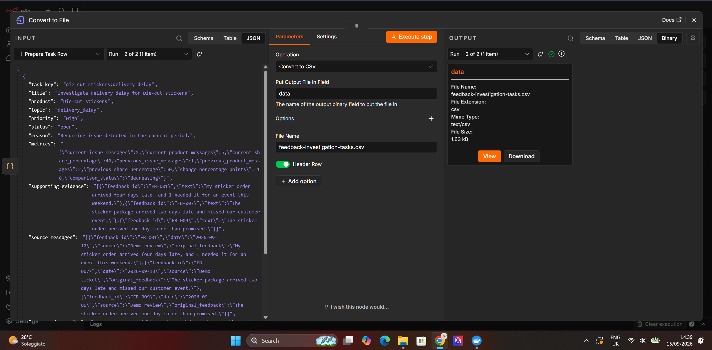

# Feedback Investigator

**Turn scattered customer feedback into evidence-backed investigation tasks.**


## The problem

I built Feedback Investigator around a simple ecommerce problem: customer messages are easy to read one by one, but difficult to understand as a pattern.

Imagine Mark runs a store selling custom printed products.

His team receives reviews and support tickets about late deliveries, damaged packages, print quality, and other issues. Someone has to read every message, remember whether similar complaints appeared before, decide which problems matter, and gather evidence before another team can investigate.

That process becomes slow and inconsistent as the number of messages grows.

Mark does not only need a summary saying that some customers are unhappy. He needs answers to practical questions:

* Which problems are happening repeatedly?
* Which products are affected?
* Is an issue increasing or decreasing?
* Which customer messages support the finding?
* What should the team investigate first?

Feedback Investigator turns a supplied feedback dataset into a reviewable investigation queue.

## What happens during an investigation

When the user starts a run, the system:

1. Classifies every customer message by topic and severity.
2. Preserves evidence from the original message.
3. Checks that the evidence really exists in the source text.
4. Groups related complaints by product, topic, and reporting period.
5. Detects problems reported more than once.
6. Compares the current period with a previous-period baseline.
7. Creates prioritized investigation tasks.
8. Marks urgent tasks for faster human review.
9. Stores the complete run in PostgreSQL.

Positive and neutral messages remain visible in the results, but they do not create complaint investigation tasks.

## A realistic result

Suppose the system receives these messages:

```text
“My sticker order arrived four days late, and I needed it for an event.”

“The sticker package arrived two days late and missed our customer event.”

“The sticker order arrived one day later than promised.”
```

Instead of leaving an operations manager to find and combine them manually, Feedback Investigator creates:

```text
Investigate delivery delay for Die-cut stickers

Priority: High
Urgent: Yes
Current reports: 3
Current share: 50.0%
Previous share: 50.0%
Change: 0.0 percentage points
Trend: Unchanged

Recommended next step:
Compare promised delivery dates with dispatch and carrier
tracking records before assigning a cause.
```

The task also keeps the original feedback IDs and exact supporting messages, allowing a reviewer to verify the finding.

## What you can test

The repository contains a complete local application:

* A React and TypeScript reviewer dashboard
* An editable fictional feedback dataset
* A Go investigation engine
* A typed GraphQL API
* PostgreSQL persistence
* Current-versus-previous-period comparison
* Evidence-backed investigation tasks
* Docker Compose setup
* Go unit tests
* The original n8n and GPT-5 mini workflow

The default demo does not require an API key or access to company systems.

## Run the application

### Requirements

You only need:

* Git
* Docker Desktop
* Docker Compose

### Windows PowerShell

```powershell
git clone https://github.com/kiraxo/feedback-investigator.git
Set-Location ".\feedback-investigator"
Copy-Item ".\.env.example" ".\.env"
docker compose up --build -d
```

### macOS or Linux

```bash
git clone https://github.com/kiraxo/feedback-investigator.git
cd feedback-investigator
cp .env.example .env
docker compose up --build -d
```

When the containers are ready, open:

| Service            | Address                 |
| ------------------ | ----------------------- |
| Reviewer dashboard | `http://localhost:3000` |
| GraphQL Playground | `http://localhost:8080` |
| PostgreSQL         | `localhost:5433`        |

Click **Run investigation** in the dashboard to process the included dataset.

To stop the application:

```bash
docker compose down
```

To also remove the local database volume:

```bash
docker compose down -v
```

## How the application is organized



The responsibilities are separated deliberately:

* **Frontend:** submits feedback and presents results for human review.
* **GraphQL API:** provides typed operations for running and retrieving investigations.
* **Investigation engine:** classifies feedback, validates evidence, groups issues, and creates tasks.
* **Repository layer:** stores and retrieves completed agent runs.
* **PostgreSQL:** preserves results after the API is restarted.

The service can use an in-memory repository during testing or PostgreSQL during normal Docker operation.

## Evidence before conclusions

A generated finding should be traceable to the customer who reported it.

For every classification, the system checks:

* The topic belongs to the supported topic list.
* Severity is an integer from 0 to 3.
* Positive and neutral messages have severity 0.
* Evidence appears in the original feedback text.
* Generated tasks preserve the supporting feedback IDs.

If evidence cannot be verified, the result should not silently become an operational task.

## Recurring issues and period comparison

Feedback is grouped using:

```text
Product + Topic + Period
```

A task is created when at least two current-period messages report the same issue for the same product.

For each recurring issue, the system calculates:

| Metric                    | Meaning                                              |
| ------------------------- | ---------------------------------------------------- |
| Current issue messages    | Reports of this issue in the current dataset         |
| Current product messages  | All current feedback for the product                 |
| Current share             | Issue reports as a share of current product feedback |
| Previous issue messages   | Reports of the issue in the baseline period          |
| Previous product messages | All baseline feedback for the product                |
| Previous share            | Baseline issue share                                 |
| Change                    | Difference between the two shares                    |
| Comparison                | Increasing, decreasing, unchanged, or no baseline    |

These percentages describe the uploaded feedback dataset. They are not product defect rates or percentages of total orders.

## Demo mode and AI mode

The Go application currently uses a deterministic demo provider.

I chose this approach so that a reviewer can clone the repository and test the complete system without paying for model usage or configuring private credentials. It also makes the investigation rules repeatable and easy to test.

The repository also contains the original n8n workflow, which uses GPT-5 mini for structured classification and includes optional Slack and Gmail notification steps.

The Go service does not currently include live OpenAI, Claude, Grok, or open-source model adapters. Those providers are a future extension of the provider interface, not a feature claimed by the current demo.

## Original n8n workflow

The project began as an n8n workflow before being expanded into a full application.

The workflow:

1. Receives fictional customer feedback.
2. Sends each message to GPT-5 mini.
3. requests structured classification output.
4. Validates evidence against the original text.
5. Groups recurring problems.
6. Compares reporting periods.
7. Creates prioritized tasks.
8. Routes urgent cases to optional Slack or Gmail nodes.
9. Exports the final tasks as CSV.

Import this file into n8n:

```text
n8n/feedback-investigator-workflow.json
```

To use the AI workflow, select your own OpenAI credential in the **OpenAI Chat Model** node. Slack and Gmail credentials are only required if you enable those optional notification nodes.

### Workflow overview


### Classification output



### Investigation tasks


## GraphQL example

Check the API:

```graphql
query {
  health {
    status
    service
    version
  }
}
```

Retrieve a stored investigation:

```graphql
query GetAgentRun($id: ID!) {
  agentRun(id: $id) {
    id
    status
    provider
    feedbackCount
    startedAt
    completedAt
    tasks {
      taskKey
      title
      priority
      urgent
      supportingEvidence {
        feedbackId
        text
      }
      metrics {
        currentIssueMessages
        currentSharePercentage
        previousSharePercentage
        changePercentagePoints
        comparisonStatus
      }
      recommendedAction
    }
  }
}
```

Completed runs remain available after restarting the API because they are stored in PostgreSQL.

## Tests

Run the backend tests:

```powershell
Set-Location ".\backend"
go test ./... -v
go vet ./...
```

The tests cover:

* Recurring issue detection
* Task creation
* Evidence validity
* Positive feedback handling
* Period calculations
* Empty dataset rejection
* Unconfigured live-provider rejection
* Repository behavior

Check the frontend:

```powershell
Set-Location ".\frontend"
npm.cmd install
npm.cmd run lint
npm.cmd run build
```

## Technology choices

| Area                 | Technology                     |
| -------------------- | ------------------------------ |
| Investigation engine | Go                             |
| API                  | GraphQL with gqlgen            |
| Database             | PostgreSQL with pgx            |
| Dashboard            | React and TypeScript           |
| Frontend tooling     | Vite and ESLint                |
| Runtime              | Docker Compose                 |
| Web server           | Nginx                          |
| AI workflow          | n8n and GPT-5 mini             |
| Notifications        | Optional Slack and Gmail nodes |
| Export               | CSV                            |

## Repository structure

```text
feedback-investigator/
├── backend/
│   ├── graph/                 GraphQL schema and resolvers
│   └── internal/
│       ├── agent/             Investigation logic
│       └── storage/           PostgreSQL and memory repositories
├── frontend/                  React and TypeScript dashboard
├── migrations/                PostgreSQL migration
├── n8n/                       Original AI workflow
├── samples/                   Example task output
├── screenshots/               Workflow and output images
├── docker-compose.yml
├── .env.example
└── README.md
```

## Current boundaries

This is a portfolio prototype built with fictional data.

It currently expects feedback to be supplied through the dashboard or GraphQL API. It does not automatically collect reviews from public websites or connect to a real support platform.

A production version would need:

* Connectors for review, ecommerce, and support systems
* Authentication and role-based authorization
* Encrypted secret management
* Live model-provider adapters
* Monitoring and evaluation metrics
* Human approval and task-assignment workflows
* Rate limiting and retry policies
* Data-retention and privacy controls

These boundaries are documented deliberately so that the demo does not claim capabilities it has not implemented.

## Why I built it

I wanted to build something beyond a single model prompt.

The interesting part of this project is the work around the model: validating evidence, comparing periods, deciding when an issue is recurring, preserving results, exposing them through an API, and giving a human reviewer a usable interface.

The project started as an n8n experiment and evolved into a Go, GraphQL, PostgreSQL, and TypeScript application that another developer can run locally with one command.

## Author

**Khaireddine Slougui**

[GitHub profile](https://github.com/kiraxo)

