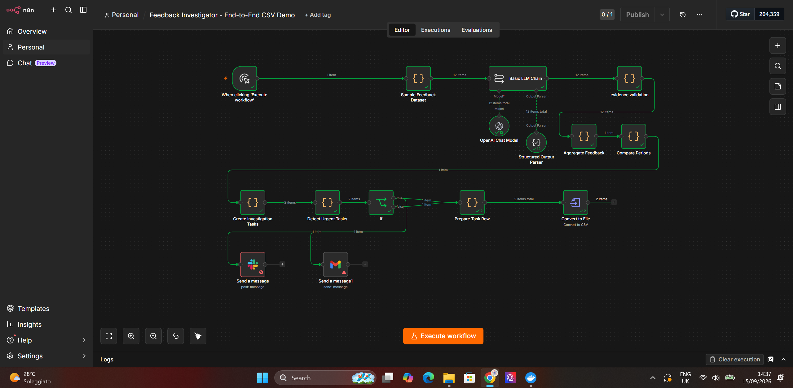
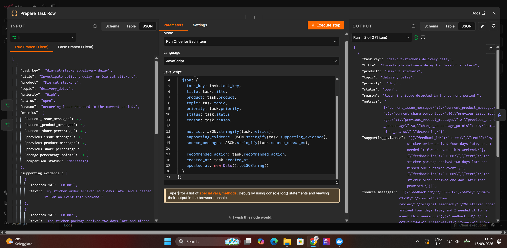

# 🔎 Feedback Investigator

### Evidence-based customer feedback analysis with n8n and GPT-5 mini

Feedback Investigator turns customer reviews and support messages into clear, evidence-backed investigation tasks.

It uses GPT-5 mini to classify feedback, validates the model’s evidence against the original message, detects recurring problems, compares time periods, identifies urgent cases, sends optional Slack or Gmail notifications, and exports the final tasks as a CSV file.

> This is an independent portfolio project inspired by commerce operations. It is not connected to Sticker Mule systems, and all included feedback is fictional.

---

## ✨ What it does

```text
Customer feedback
        ↓
GPT-5 mini classification
        ↓
Structured JSON output
        ↓
Evidence validation
        ↓
Recurring issue detection
        ↓
Period comparison
        ↓
Prioritized investigation tasks
        ↓
Urgent Slack / Gmail notification
        ↓
Downloadable CSV report
```

The workflow currently processes sample feedback for:

- 🚚 Delivery delays
- 📦 Damaged packaging
- 🖨️ Print quality
- 🧲 Adhesion problems
- 🎨 Artwork process issues
- 💬 Other complaints
- 👍 Positive feedback
- ❓ Neutral questions

---

## 🧠 Why the evidence validation matters

The workflow does not automatically trust the LLM response.

For every classification, it checks that:

- the topic is from the allowed list;
- the severity is between 0 and 3;
- positive and neutral messages have severity 0;
- the evidence is an exact phrase from the original customer message.

If the model invents evidence, the workflow stops with an error.

---

## 🚦 Priority and urgency

The workflow groups messages by product and topic.

A task becomes urgent when it has one or more of these signals:

- 🔴 High priority
- ⚠️ Severity 3
- 📈 A significant increase compared with the previous period
- 🔁 Multiple current-period reports

Urgent tasks can be routed to:

- Slack
- Gmail

Both notification integrations are optional and require the user’s own credentials.

---

## 📊 Period comparison

The workflow compares two adjacent periods and reports:

- current issue messages;
- previous issue messages;
- current product feedback total;
- previous product feedback total;
- percentage change;
- increasing, decreasing, unchanged, or no-baseline status.

Percentages represent the share of uploaded feedback for that product.

They are not defect rates or percentages of total orders.

---

## 📁 Repository contents

| File | Purpose |
|---|---|
| `feedback-investigator-workflow.json` | Importable n8n workflow |
| `sample-investigation-tasks.csv` | Example generated task report |
| `workflow-overview.png` | Full workflow screenshot |
| `classification-output.png` | Classification and validation result |
| `tasks-output.png` | Generated investigation tasks |

---

## 🖼️ Workflow overview



## 🧾 Classification output


## ✅ Investigation task output



---

## ▶️ How to run

1. Install n8n.
2. Download `feedback-investigator-workflow.json`.
3. Import the workflow into n8n.
4. Open the **OpenAI Chat Model** node.
5. Select your own OpenAI credential.
6. Set the model to:

```text
gpt-5-mini
```

7. Click **Execute Workflow**.
8. Open the final **Convert to File** node.
9. Download the generated CSV report.

The workflow uses fictional sample feedback and does not require access to any company database.

---

## 🔔 Optional notifications

Slack and Gmail nodes are included for urgent cases.

To enable notifications:

1. Add your own Slack or Gmail credential in n8n.
2. Select a private test channel or your own email address.
3. Enable the notification node.
4. Execute the workflow again.

Credentials are intentionally not included in this repository.

---

## 🛠️ Technology

- n8n
- OpenAI GPT-5 mini
- JavaScript Code nodes
- Structured Output Parser
- Slack integration
- Gmail integration
- CSV export

---


## 📌 Example result

A recurring issue may produce a task such as:

```text
Task: Investigate damaged packaging for Die-cut stickers
Priority: Medium
Current messages: 2
Previous messages: 1
Status: Decreasing
Recommended action: Review supporting reports and compare packing methods with carrier handling records.
```

The final report preserves the original source messages and the exact evidence used for the finding.

---

