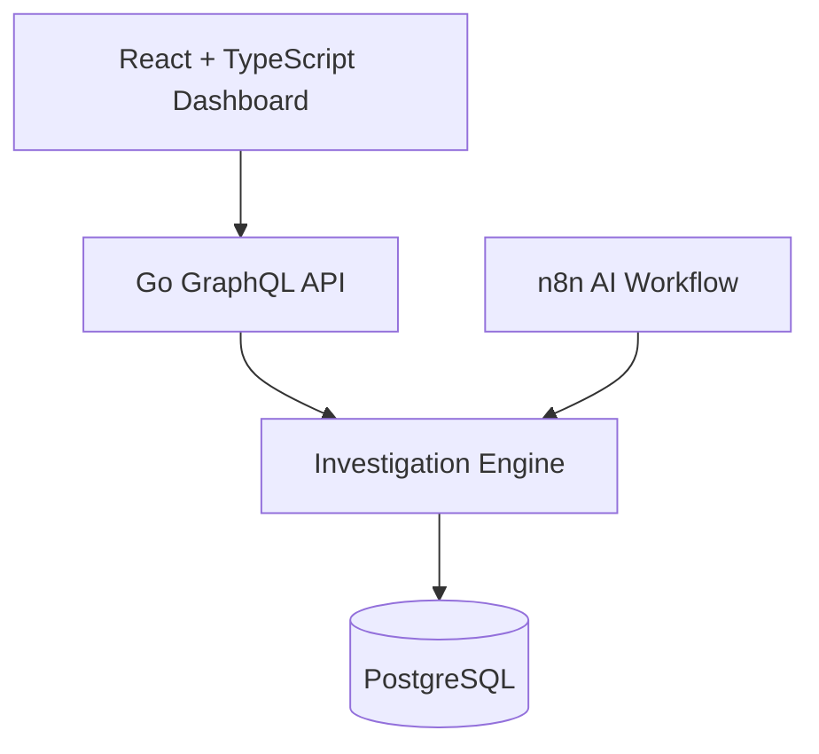

# 🔎 Feedback Investigator

### Evidence-based customer feedback investigation built with Go, GraphQL, PostgreSQL, TypeScript, n8n, and AI

Feedback Investigator turns customer reviews and support messages into clear, evidence-backed investigation tasks.

It classifies feedback, validates evidence against the original messages, detects recurring problems, compares current and previous periods, prioritizes investigation tasks, and preserves completed runs in PostgreSQL.

The repository includes:

* A Go investigation engine
* A GraphQL API
* PostgreSQL persistence
* A React and TypeScript review dashboard
* A deterministic demo provider that works without an API key
* The original n8n and GPT-5 mini workflow
* Optional Slack and Gmail notifications in n8n
* A complete Docker environment


---

## ✨ What it does

```text
Customer feedback
        ↓
Topic and severity classification
        ↓
Exact evidence validation
        ↓
Recurring issue detection
        ↓
Current vs previous period comparison
        ↓
Priority and urgency calculation
        ↓
Investigation task creation
        ↓
PostgreSQL persistence
        ↓
GraphQL API and reviewer dashboard
```

The investigator currently recognizes:

* 🚚 Delivery delays
* 📦 Damaged packaging
* 🖨️ Print quality problems
* 🧲 Adhesion problems
* 🎨 Artwork process issues
* 💬 Other complaints
* 👍 Positive feedback
* ❓ Neutral questions

---

## 🖥️ Reviewer dashboard

The TypeScript dashboard provides an end-to-end demonstration of the agent.

From the interface, a reviewer can:

* Edit or replace the sample feedback dataset
* Run the investigation
* Review every classification
* See severity and evidence-validation results
* Inspect recurring issues
* Compare current and previous periods
* Review prioritized and urgent tasks
* Read the evidence supporting each task
* See the recommended operational action

The complete application runs locally with Docker Compose.

```text
Dashboard:          http://localhost:3000
GraphQL Playground: http://localhost:8080
PostgreSQL:         localhost:5433
```

---

## 🧠 Why evidence validation matters

The system does not automatically trust a model-generated result.

For every classification, it verifies that:

* The topic belongs to the allowed topic list
* Severity is an integer from 0 to 3
* Positive and neutral feedback has severity 0
* Supporting evidence exists in the original customer message
* Investigation tasks preserve the feedback IDs supporting the finding

This prevents invented evidence from silently becoming an operational task.

---

## 🔁 Recurring issue detection

Feedback is grouped by:

```text
Product + Topic + Period
```

An investigation task is created when the same issue appears in at least two current-period messages for a product.

Positive and neutral messages are preserved in the classification results but do not create investigation tasks.

Every generated task contains:

* A stable task key
* Product and issue topic
* Priority and status
* Current and previous message totals
* Current and previous feedback shares
* Percentage-point change
* Comparison status
* Supporting feedback IDs
* Exact supporting evidence
* A recommended investigation action
* Urgency status and reason

---

## 📊 Period comparison

The investigator compares current-period feedback with a previous-period baseline.

It reports:

* Current issue messages
* Previous issue messages
* Current product feedback total
* Previous product feedback total
* Current feedback share
* Previous feedback share
* Percentage-point change
* Increasing, decreasing, unchanged, or no-baseline status

> Percentages represent the share of uploaded feedback for that product. They are not defect rates or percentages of total customer orders.

---

## 🚦 Priority and urgency

The system calculates priority from the available feedback evidence.

A task may become urgent when it includes signals such as:

* 🔴 High priority
* ⚠️ Severity 3 feedback
* 🔁 Multiple current-period reports
* 📈 A meaningful increase compared with the previous period

The original n8n workflow can route urgent tasks to:

* Slack
* Gmail

Both integrations are optional and require the tester’s own credentials.

---

## 🏗️ Architecture



The project separates the interface, API, investigation logic, and storage layers.

The Go service depends on a repository interface, allowing PostgreSQL to be replaced with an in-memory implementation during tests or local development.

---

## 🛠️ Technology

### Backend

* Go
* gqlgen
* GraphQL
* pgx
* PostgreSQL
* Go unit tests

### Frontend

* React
* TypeScript
* Vite
* ESLint
* Nginx

### AI and automation

* n8n
* OpenAI GPT-5 mini
* Structured Output Parser
* JavaScript Code nodes
* Slack integration
* Gmail integration
* CSV export

### Infrastructure

* Docker
* Docker Compose
* Multi-stage container builds
* PostgreSQL health checks
* Non-root API container

---

## ▶️ Quick start with Docker

### Requirements

Install:

* Git
* Docker Desktop
* Docker Compose

No Go, Node.js, PostgreSQL, n8n, or API key is required to run the Docker demo.

### 1. Clone the repository

```powershell
git clone https://github.com/kiraxo/feedback-investigator.git
Set-Location ".\feedback-investigator"
```

### 2. Create the environment file

On Windows PowerShell:

```powershell
Copy-Item ".\.env.example" ".\.env"
```

On macOS or Linux:

```bash
cp .env.example .env
```

### 3. Start the complete application

```powershell
docker compose up --build -d
```

### 4. Open the dashboard

```text
http://localhost:3000
```

Click **Run investigation** to execute the included sample dataset.

### 5. Open GraphQL Playground

```text
http://localhost:8080
```

### 6. Stop the application

```powershell
docker compose down
```

To also delete the local PostgreSQL development volume:

```powershell
docker compose down -v
```

---

## 🧪 Deterministic demo mode

The default application uses a deterministic provider.

This means reviewers can test the entire workflow immediately without:

* An OpenAI API key
* Paid model usage
* Access to private company systems
* External customer data
* A manually configured database

The deterministic provider follows documented topic, severity, recurrence, priority, and comparison rules.

This makes the demo:

* Repeatable
* Testable
* Free to run
* Easy to evaluate
* Suitable for automated tests

The provider boundary is designed so model-backed implementations can be added separately.

> OpenAI, Claude, Grok, and open-source live provider adapters are not yet implemented in the Go service. The included n8n workflow demonstrates the GPT-5 mini integration.

---

## 🔌 GraphQL API

### Health query

```graphql
query {
  health {
    status
    service
    version
  }
}
```

Example response:

```json
{
  "data": {
    "health": {
      "status": "ok",
      "service": "feedback-investigator-api",
      "version": "0.2.0"
    }
  }
}
```

### Retrieve a preserved agent run

```graphql
query GetAgentRun($id: ID!) {
  agentRun(id: $id) {
    id
    status
    mode
    provider
    feedbackCount
    startedAt
    completedAt
    tasks {
      taskKey
      title
      priority
      urgent
      metrics {
        currentIssueMessages
        currentSharePercentage
        previousSharePercentage
        changePercentagePoints
        comparisonStatus
      }
    }
  }
}
```

Completed runs can still be retrieved after restarting the API because they are stored in PostgreSQL.

---

## ✅ Testing

### Backend

From the repository root:

```powershell
Set-Location ".\backend"
go test ./... -v
go vet ./...
```

The test suite covers:

* Recurring issue detection
* Investigation task creation
* Positive feedback handling
* Empty dataset rejection
* Unconfigured live-provider rejection
* Evidence validity
* Period comparison calculations
* Run persistence behavior

### Frontend

```powershell
Set-Location ".\frontend"
npm.cmd install
npm.cmd run lint
npm.cmd run build
```

---

## 🤖 Original n8n workflow

The original workflow remains included as an alternative visual implementation.

It uses GPT-5 mini to:

1. Read customer feedback
2. Return structured classifications
3. Validate exact evidence
4. Group issues by product and topic
5. Compare current and previous periods
6. Create prioritized tasks
7. Detect urgent cases
8. Send optional notifications
9. Export tasks as CSV

### Run the n8n version

1. Install or open n8n.
2. Import:

```text
n8n/feedback-investigator-workflow.json
```

3. Open the **OpenAI Chat Model** node.
4. Select your own OpenAI credential.
5. Set the model to:

```text
gpt-5-mini
```

6. Configure Slack or Gmail only if you want notifications.
7. Click **Execute Workflow**.
8. Download the CSV from the final file-conversion node.

Credentials are intentionally not included in this repository.

---

## 📁 Repository contents

| Path                                      | Purpose                                  |
| ----------------------------------------- | ---------------------------------------- |
| `backend/`                                | Go GraphQL API and investigation engine  |
| `backend/internal/agent/`                 | Classification and task-generation logic |
| `backend/internal/storage/`               | PostgreSQL and in-memory repositories    |
| `backend/graph/`                          | GraphQL schema and resolvers             |
| `frontend/`                               | React and TypeScript reviewer dashboard  |
| `migrations/`                             | PostgreSQL database migration            |
| `n8n/feedback-investigator-workflow.json` | Importable n8n workflow                  |
| `samples/sample-investigation-tasks.csv`  | Example task report                      |
| `screenshots/workflow-overview.png`       | Original n8n workflow                    |
| `screenshots/classification-output.png`   | Classification output                    |
| `screenshots/tasks-output.png`            | Investigation task output                |
| `docker-compose.yml`                      | Complete local application stack         |
| `.env.example`                            | Safe local configuration template        |

---

## 🖼️ Original workflow

### Workflow overview


### Classification output


### Investigation task output


---

## 📌 Example result

A recurring issue can create a task such as:

```text
Task: Investigate delivery delay for Die-cut stickers
Priority: High
Urgent: Yes
Current reports: 3
Current share: 50.0%
Previous share: 50.0%
Change: 0.0 percentage points
Comparison: Unchanged
Recommended action:
Compare promised delivery dates with dispatch and carrier
tracking records before assigning a cause.
```

The task preserves the original feedback IDs and exact supporting evidence.

---

## 🔐 Security and reliability

* No API keys or service credentials are committed
* Environment configuration uses `.env`
* `.env` is excluded from Git
* Docker secrets remain local
* The API container runs as a non-root user
* PostgreSQL is protected by configurable local credentials
* GraphQL operations use typed inputs and outputs
* The application rejects empty feedback datasets
* Live providers are rejected unless explicitly configured
* Evidence remains traceable to the source feedback

---

## ⚠️ Current limitations

This portfolio version uses fictional input data and a deterministic provider for public testing.

A production deployment would additionally require:

* Authentication and authorization
* Rate limiting
* Encrypted secret management
* Organization-specific topic policies
* Human approval workflows
* Monitoring and alerting
* Production migrations
* Data retention policies
* Personally identifiable information handling
* Live model-provider adapters
* Integration with internal order and support systems

---

## 🚀 Project evolution

This project began as an n8n AI workflow and was expanded into a testable application platform.

The repository demonstrates:

* Visual AI automation with n8n
* Deterministic agent behavior
* Evidence grounding
* Go service development
* GraphQL API design
* PostgreSQL persistence
* TypeScript interface development
* Automated testing
* Containerized local deployment
* Clear operational documentation

---

## 👤 Author

**Khaireddine Slougui**

GitHub: [github.com/kiraxo](https://github.com/kiraxo)

---

## 📄 Disclaimer

This is an independent portfolio project.

